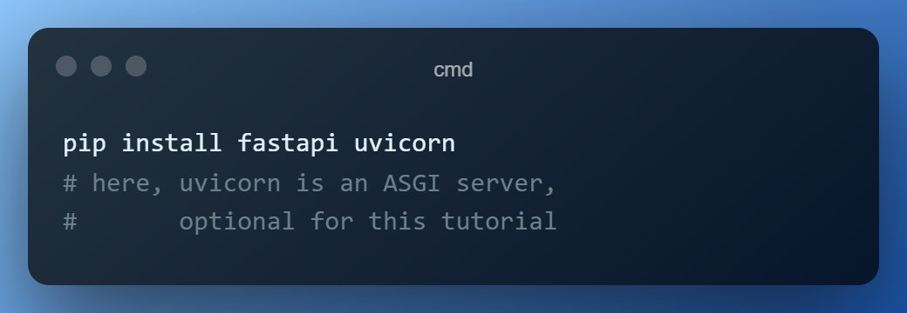
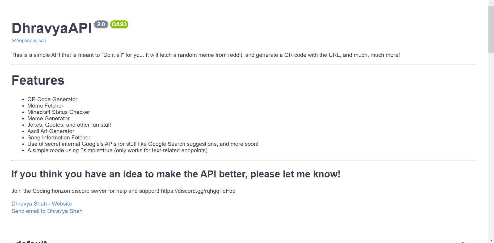

When thinking of APIs, most people think of REST apis (web APIs). Well, APIs are much more than that - In this blog, I’ll explain what exactly APIs are, and we’ll also make a REST API using FastAPI (Python) ⚡ 

- What are APIs?
- How do APIs work?
- Real life examples
- How to make your own API in python using FastAPI

## What are APIs?

Simply speaking, APIs are just constructs that abstract a bit of complex code (Javascript DOM API) , or act as a link between codebases (frontend and backend, for example). APIs can also be really helpful to “connect” programming languages and modify and transfer data from one language to another

[Mozilla has an amazing article on this](https://developer.mozilla.org/en-US/docs/Learn/JavaScript/Client-side_web_APIs/Introduction)

Here’s what it says in short:

> Application Programming Interfaces (APIs) are constructs made available in programming languages to allow developers to create complex functionality more easily. They abstract more complex code away from you, providing some easier syntax to use in its place.
> 

An amazing analogy to explain APIs (also from mozilla)- 

As a real-world example, think about the electricity supply in your house, apartment, or other dwellings. If you want to use an appliance in your house, you plug it into a plug socket and it works. You don't try to wire it directly into the power supply — to do so would be really inefficient and, if you are not an electrician, difficult and dangerous to attempt.


Generally speaking, adding microservices to your codebase is a good idea. APIs are also kinda similar to cloud functions

## Types of APIs

Types of APIs
There are a few different types of APIs you should know about
There are the program-centric APIs like in Java, (that let objects talk to each other)
And web-centric APIs like:
REST API (Representational State Transfer)
GraphQL API
(there are many more ... but out of context here)

## Making your own API⚡⚡

Some popular programming languages to make APIs are - Javascript, Python, Go, Rust (there are a lot more but these are the most popular)

Let’s make an API in Python - It’s really easy with FastAPI!

There are multiple options to make an API in python (like Flask, Quart, Fastapi). I chose Fastapi because it’s fast and made with APIs in mind

OK, now 

First, install the requirements



In Python and javascript, making APIs is really easy because it’s just a function with a decorator 

```python
from fastapi import FastAPI

app = FastAPI()

@app.get("/")
def hello():
    return {"Hello": "World"}
```

That’s LITERALLY it! 

First, we imported `fastapi`, then declared the app. You can pass multiple configurations to the app and fastapi also automatically generates Swagger ui Docs and Redoc page. (picture below is swagger docs, available on `/docs` endpoint)



You can have arguments like so :

```python
@app.get("/items")
def read_item(q: Optional[str] = None):
    return {"q": q}
```

This will return the bread for q on the URL [http://127.0.0.1:8000/items?q=bread](http://127.0.0.1:8000/items?q=bread)

You can also have dynamic endpoints, like so :

```python
@app.get("/user/{user_name}")
def read_item(user_name:str):
    return {"username": user_name}
```

Now, if I go to the URL [http://127.0.0.1:8000/user/dhravya](http://127.0.0.1:8000/user/dhravya) , it will return “username: dhravya”

But how to run the server? 

Use this command : 

```powershell
uvicorn main:app --reload
```

and it should show 

```verilog
INFO:     Uvicorn running on http://127.0.0.1:8000 (Press CTRL+C to quit)
INFO:     Started reloader process [28720]
INFO:     Started server process [28722]
INFO:     Waiting for application startup.
INFO:     Application startup complete.
```

ANND that’s it! APIs are easy. Now you can connect your React frontend to python backend!

It does not end here! Go to [https://fastapi.tiangolo.com](https://fastapi.tiangolo.com/) FastAPI docs and mess around! Or make your own API 

The web is fullll of APIs. Utilising them will save your time!

## Now you know

Now you know:

- APIs are *not only* web APIs
- What are APIs
- How to make APIs and deploy them
- FastAPI - Parameters and dynamic URLs

Comment below if you want me to make the same tutorial but for Express.JS or Rust

If you liked this blog, or if it helped you in ANY way, make sure to 💖 this blog and [follow me on dev.to](https://dev.to/dhravya). I try to write informative tutorials, blogs and about interesting tools and products every week!

Connect with me on Twitter - [https://twitter.com/dhravyashah](https://twitter.com/dhravyashah)

If you have any programming questions, [ask on Counsily](https://play.google.com/store/apps/details?id=com.counsily). I’ll try to answer them as soon as I can!