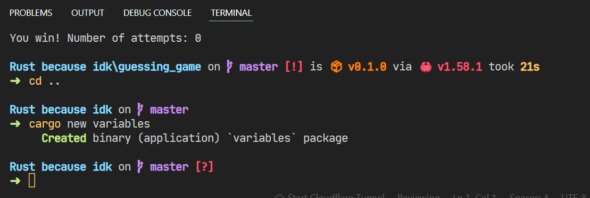
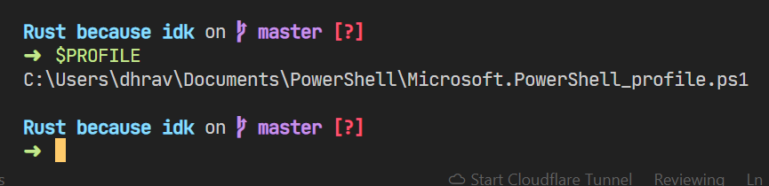
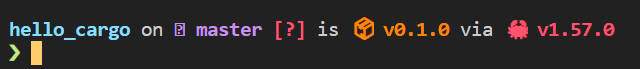
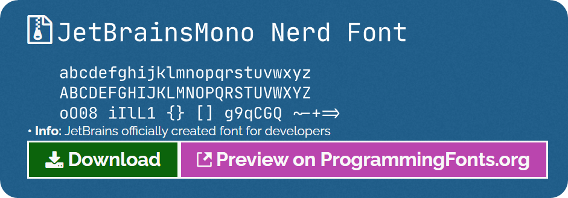
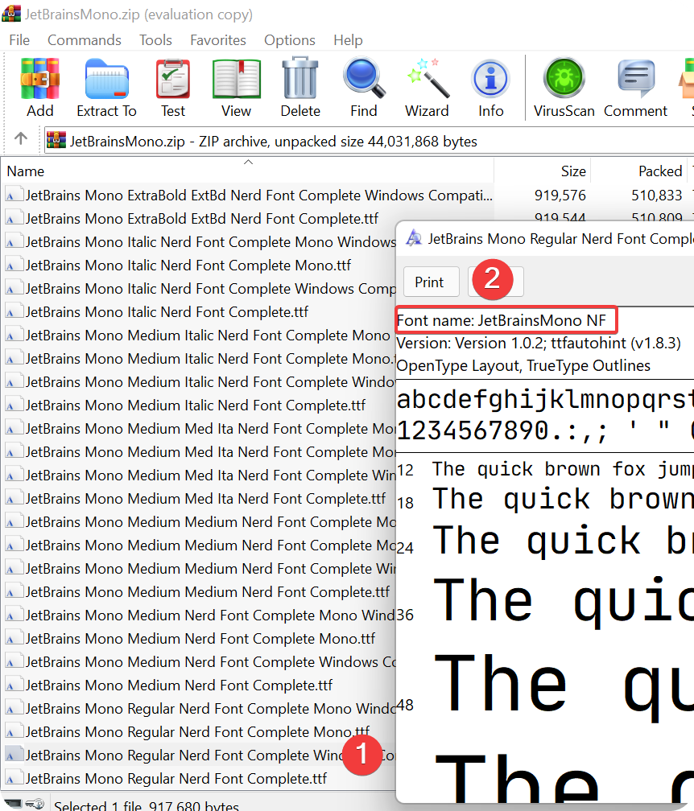
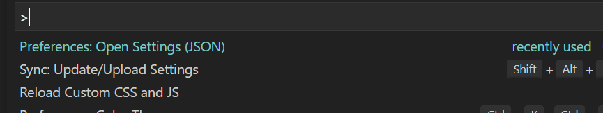

How I customized my terminal  to look really good using Starship, Powershell and Nerd Fonts

Yesterday, while chatting in our discord server [The Coding Horizon](https://discord.io/code), my friend, [nexxel](https://personal-website-nexxeln.vercel.app/) told me about a really cool cross-platform prompt called Starship

I’ve always been trying to get a new, better looking terminal and this one is literally perfect!

<!--  -->

Yes, I’m learning Rust!

Setting it up was also super simple and took less than 5 minutes

I installed Starship using [Cargo](https://crates.io), the Rust package manager, using this command

> cargo install starship --locked
> 

Now that Starship is installed, all I had to do is set up my powershell to use it by default.

- Get the config file path using $PROFILE
- Add a code snippet

Since I’m doing all this in powershell, everything is relatively easy. Starship is cross-platform and will work on [pretty much any shell you can think of](https://starship.rs/guide/#🚀-installation)

Get the config file path using `$PROFILE`

Open the file in text editor of you choice (I used the command `code C:\\ ...` )

For powershell, I had to paste this [according to the docs](https://starship.rs)

`Invoke-Expression (&starship init powershell)`

and then after restarting the terminal, Voila! Starship was installed, but not Nerd fonts. 

It looked weird with some characters not in the font

I went ahead to download and install the Jetbrains Mono NF 

And then install it by opening the Zip and the `.tff` or  .`otf` file and clicking on `install`

Note the `Font name:`, we’ll need it later

Now all that’s needed to do is to tell your VScode to use the jetbrains mono font

I did this by going to the editor settings and adding this snippet 
`"terminal.integrated.fontFamily": "JetBrainsMono NF",`

Andddd that’s it!!! I had this BEAUTIFUL Terminal  by the end!

<!--  -->